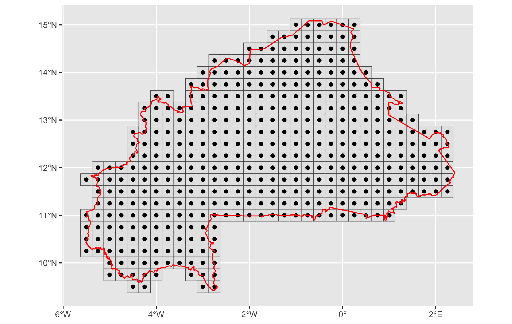

```{r setup, include=FALSE}
knitr::opts_chunk$set(
  eval    = FALSE,
  echo    = TRUE,
  warning = FALSE,
  message = FALSE,
  comment = "#>"
)
```

## Overview

This vignette describes the complete pipeline for running **AquaCrop**
simulations across Burkina Faso using gridded ERA5 data and the
`aquacroptools` package. AquaCrop (Steduto et al., 2009; Raes et al.,
2009) is the FAO reference model for simulating crop yield response to
water stress. The package automates the entire file-based workflow —
input file generation, batch simulation, and output parsing — while
always delegating computation to the official FAO binary, ensuring full
scientific validity.

The workflow is divided into five steps:

1.  **Project setup** — Initialise the AquaCrop directory structure
2.  **`process_climate`** — Preprocess ERA5 climate data and build the
    simulation grid
3.  **`process_soil`** — Extract soil properties from HWSD
4.  **`write_inputs`** — Write all AquaCrop input files in batch
5.  **`run_aquacrop`** — Launch simulations

### Project folder structure

```         
project/
├── RAWDATA/
│   ├── climate/             # Raw ERA5 NetCDF files
│   │   ├── BF_PCP_day.nc
│   │   ├── BF_TX_day.nc
│   │   ├── BF_TN_day.nc
│   │   └── BF_ETO_day.nc
│   ├── soil/
│   │   └── hwsd_wa_usda_all_layers.tif
│   └── shapefiles/
│       └── bfa_admbnda_adm0_igb_20200323.shp
├── DATA/
│   ├── climate/             # Masked GeoTIFFs + final CSV
│   ├── soil/                # Soil CSV per grid cell
│   └── shapefiles/          # ERA5 grid (pts_grid.shp)
├── SRC/
│   └── hwsdb_helpers.R      # HWSD utility functions
├── CLIMATE/                 # .PLU .Tnx .ETo .CLI (generated)
├── CROP/                    # .CRO (generated)
├── SOIL/                    # .SOL .SW0 (generated)
├── MANAGEMENT/              # .MAN .IRR (generated)
├── CAL/                     # .CAL onset calendars (optional)
├── LIST/                    # .PRM project files (generated)
└── RESULTS/                 # AquaCrop outputs (generated)
```

### Required packages

```{r packages}
library(aquacroptools)
library(tidyverse)
library(terra)
library(sf)
library(tidyterra)
library(tictoc)

# HWSD utility functions
source("SRC/hwsdb_helpers.R")
```

------------------------------------------------------------------------

## Step 1 — Project setup

`init_aquacrop()` creates the standard AquaCrop folder structure and
downloads the official FAO binary for your operating system. Run this
once per project.

```{r init}
init_aquacrop(path = "my-project", version = "7.2")
```

This opens a new RStudio project with a `readme.txt` explaining the
directory layout.

------------------------------------------------------------------------

## Step 2 — Climate preprocessing (`process_climate`)

ERA5 data are provided in NetCDF format at a spatial resolution of
**0.25°** (\~28 km). This step clips the rasters to the Burkina Faso
boundary, builds the simulation grid, and exports a tidy CSV ready for
AquaCrop.

### Load the national boundary shapefile

```{r load-shapefile}
shp <- st_read("RAWDATA/shapefiles/bfa_admbnda_adm0_igb_20200323.shp")
```

### Clip and mask ERA5 rasters

A generic function processes all four variables identically. It reads
the NetCDF, clips it to the shapefile extent, masks pixels outside the
country boundary, and writes the result as a GeoTIFF.

```{r process-raster-fn}
process_raster <- function(var_name, shp) {
  input_file  <- sprintf("RAWDATA/climate/BF_%s_day.nc", var_name)
  output_file <- sprintf("DATA/climate/BF_%s_day_msk.tif", var_name)

  rast(input_file) |>
    crop(shp) |>
    mask(mask = shp) |>
    writeRaster(filename = output_file, overwrite = TRUE)

  message(sprintf("v %s processed", var_name))
}

walk(
  .x = c("PCP", "TX", "TN", "ETO"),
  .f = process_raster,
  shp = shp
)
```

> **ERA5 units:** `PCP` (`tp`) and `ETO` (`evspsblpot`) are in m/day in
> raw ERA5 — multiply by 1000 to obtain mm/day. Temperature variables
> (`t2m`) should already be in °C in the provided NetCDF files.

### Build the simulation grid

Valid pixel coordinates from the masked TX raster define grid cell
centres. Each pixel becomes an `sf` point identified by a station name
(`grid_001`, `grid_002`, …).

```{r generate-grid}
pts <- rast("DATA/climate/BF_TX_day_msk.tif") |>
  as_tibble(xy = TRUE) |>
  drop_na() |>
  select(x, y) |>
  mutate(station = sprintf("grid_%03d", 1:nrow(.))) |>
  st_as_sf(coords = c("x", "y"), crs = 4326)

# Square grid at 0.25° (ERA5 resolution)
pts_grid <- st_grid(x = pts, cellsize = 0.25, square = TRUE)

write_sf(pts_grid, "DATA/shapefiles/pts_grid.shp")
```

Visualise the grid over the country boundary. Run the block below once
in your R session (outside the vignette) to produce the figure file:

```{r visualise-grid-save, eval=FALSE}

ggplot() +
  geom_sf(data = pts_grid) +
  geom_sf(data = pts) +
  geom_sf(data = shp, fill = NA, color = "red", lwd = 0.5) +
  coord_sf() +
  labs(
    title    = "ERA5 Grid (0.25 deg) - Burkina Faso",
    subtitle = sprintf("%d simulation cells", nrow(pts))
  ) 

```



### Build the climate data frame

Each raster is pivoted to long format. Band indices map to actual dates
from the 1981–2020 time sequence.

```{r build-dates}
dates <- seq.Date(
  from = as.Date("1981-01-01"),
  to   = as.Date("2020-12-31"),
  by   = 1
)
```

A helper function avoids repeating the same pivot logic for each
variable:

```{r pivot-helper}
pivot_raster <- function(tif_path, value_name, prefix_to_remove) {
  rast(tif_path) |>
    as_tibble(xy = TRUE) |>
    drop_na() |>
    mutate(station = sprintf("grid_%03d", 1:nrow(.)), .after = y) |>
    pivot_longer(
      cols      = -c(station, x, y),
      names_to  = "date",
      values_to = value_name
    ) |>
    mutate(
      date  = str_remove_all(date, prefix_to_remove),
      date  = dates[as.numeric(date)],
      year  = year(date),
      month = month(date),
      day   = day(date),
      .after = date
    ) |>
    select(-c(x, y, date))
}
```

Apply to each variable and join:

```{r build-weather}
tn_df  <- pivot_raster("DATA/climate/BF_TN_day_msk.tif",  "tmin", "t2m_")
tx_df  <- pivot_raster("DATA/climate/BF_TX_day_msk.tif",  "tmax", "t2m_")
pcp_df <- pivot_raster("DATA/climate/BF_PCP_day_msk.tif", "rain", "tp_")
eto_df <- pivot_raster("DATA/climate/BF_ETO_day_msk.tif", "et0",  "evspsblpot_")

weather_df <- left_join(tn_df, tx_df) |>
  left_join(pcp_df) |>
  left_join(eto_df)

weather_df |>
  mutate(across(5:8, \(x) round(x, 1))) |>
  write_csv("DATA/climate/climate_grid_data.csv")
```

The output `climate_grid_data.csv` contains the following columns:

| Column  | Unit   | Description                   |
|---------|--------|-------------------------------|
| station | —      | Grid cell ID (`grid_XXX`)     |
| year    | —      | Year                          |
| month   | —      | Month                         |
| day     | —      | Day                           |
| tmin    | °C     | Daily minimum temperature     |
| tmax    | °C     | Daily maximum temperature     |
| rain    | mm/day | Precipitation                 |
| et0     | mm/day | Penman-Monteith reference ETo |

------------------------------------------------------------------------

## Step 3 — Soil properties extraction (`process_soil`)

Soil data come from the **HWSD** (Harmonized World Soil Database),
pre-processed as USDA textural class codes (1–12) for West Africa.
Hydraulic properties are derived automatically from texture via
pedotransfer functions (Saxton & Rawls, 2006) inside
`write_sol_batch()`.

### Utility functions (`hwsdb_helpers.R`)

Two functions are sourced from `SRC/hwsdb_helpers.R`.

**`num_to_usda(texture, to)`** converts an HWSD numeric code (1–12) to
one of three text formats:

| `to` argument | Output example       | Typical use case                  |
|---------------|----------------------|-----------------------------------|
| `"abr"`       | `"Lo"`, `"Sa"`       | AquaCrop input files              |
| `"name"`      | `"loam"`, `"sand"`   | English reports                   |
| `"name_fr"`   | `"limon"`, `"sable"` | French bulletins for stakeholders |

```{r num-to-usda}
num_to_usda <- function(texture = 1, to = "abr") {
  if (to == "abr") {
    dplyr::case_when(
      texture == 1  ~ "Cl",     texture == 2  ~ "SiCl",
      texture == 3  ~ "SaCl",   texture == 4  ~ "ClLo",
      texture == 5  ~ "SiClLo", texture == 6  ~ "SaClLo",
      texture == 7  ~ "Lo",     texture == 8  ~ "SiLo",
      texture == 9  ~ "SaLo",   texture == 10 ~ "Si",
      texture == 11 ~ "LoSa",   texture == 12 ~ "Sa",
      .default = NA_character_
    )
  } else if (to == "name_fr") {
    dplyr::case_when(
      texture == 1  ~ "argile",             texture == 2  ~ "argile limoneuse",
      texture == 3  ~ "argile sableuse",    texture == 4  ~ "limon argileux",
      texture == 5  ~ "limon argileux fin", texture == 6  ~ "limon argilo-sableux",
      texture == 7  ~ "limon",              texture == 8  ~ "limon fin",
      texture == 9  ~ "limon sableux",      texture == 10 ~ "limon tres fin",
      texture == 11 ~ "sable limoneux",     texture == 12 ~ "sable",
      .default = NA_character_
    )
  } else {
    dplyr::case_when(
      texture == 1  ~ "clay",            texture == 2  ~ "silty clay",
      texture == 3  ~ "sandy clay",      texture == 4  ~ "clay loam",
      texture == 5  ~ "silty clay loam", texture == 6  ~ "sandy clay loam",
      texture == 7  ~ "loam",            texture == 8  ~ "silty loam",
      texture == 9  ~ "sandy loam",      texture == 10 ~ "silt",
      texture == 11 ~ "loamy sand",      texture == 12 ~ "sand",
      .default = NA_character_
    )
  }
}
```

**`.get_mode(x)`** returns the dominant (modal) texture value within a
grid cell. Ties are broken by returning the first encountered value.

```{r get-mode}
.get_mode <- function(x, ...) {
  u   <- unique(x)
  tab <- tabulate(match(x, u))
  m   <- u[tab == max(tab, ...)]
  if (length(m) > 1L) m <- m[1]
  return(m)
}
```

### Extraction and export

```{r process-soil}
grid_shp <- read_sf("DATA/shapefiles/pts_grid.shp")

soilc   <- rast("RAWDATA/soil/hwsd_wa_usda_all_layers.tif") |> crop(grid_shp)
soil_df <- terra::extract(soilc, grid_shp, fun = .get_mode)

soil_df2 <- grid_shp |>
  bind_cols(soil_df) |>
  relocate(geometry, .after = everything()) |>
  st_drop_geometry() |>
  select(-ID) |>
  mutate_if(is.double, num_to_usda, to = "name") |>
  pivot_longer(
    cols      = -station,
    names_to  = "thickness",
    values_to = "texture"
  ) |>
  mutate(
    thickness = ifelse(thickness %in% c("D6", "D7"), 0.5, 0.2),
    cn  = 46,
    rew = 5
  )

write_csv(soil_df2, "DATA/soil/hwsd_grids.csv")
```

> **HWSD layer depths:** Layers D6 and D7 are assigned 0.5 m thickness;
> all other layers are 0.2 m. This controls the soil profile depth fed
> to AquaCrop.

The output `hwsd_grids.csv` contains the following columns:

| Column    | Description                               |
|-----------|-------------------------------------------|
| station   | Grid cell ID (`grid_XXX`)                 |
| thickness | Layer thickness (m): 0.2 or 0.5           |
| texture   | USDA textural class (full English name)   |
| cn        | Curve Number (default: 46)                |
| rew       | Readily Evaporable Water, mm (default: 5) |

------------------------------------------------------------------------

## Step 4 — Writing AquaCrop input files (`write_inputs`)

All AquaCrop input files are generated in **batch mode** for every grid
cell, with no manual editing required.

### 4.1 Climate files (`.PLU`, `.Tnx`, `.ETo`, `.CLI`)

The climate CSV is split by station; each subset is written into the
four AquaCrop climate files required per site.

```{r write-climate}
datal <- read_csv("DATA/climate/climate_grid_data.csv") |>
  group_split(station, .keep = TRUE)

tic("Writing climate files")
walk(datal, write_climate, path = "CLIMATE/")
toc()
# → CLIMATE/grid_XXX.PLU   (rainfall)
# → CLIMATE/grid_XXX.Tnx   (min/max temperature)
# → CLIMATE/grid_XXX.ETo   (reference ET)
# → CLIMATE/grid_XXX.CLI   (master file)
```

### 4.2 Crop file (`.CRO`)

Default parameters are built in for all AquaCrop crops. Override
individual parameters via `params = list(...)`, using the AquaCrop
variable identifier as the name.

```{r write-crop}
write_cro(
  path      = "CROP/",
  crop_name = "maize90days",
  params    = list(
    var_05 = 1,   # Establishment method: 1 = sown
    var_08 = 10   # Base temperature (deg C) below which development stops
  )
)
# → CROP/maize90days.CRO
```

### 4.3 Soil files (`.SOL` + `.SW0`)

HWSD data are converted to a list of parameters per station. `NA`
texture values (undefined pixels) are replaced by `"impermeable"`.

```{r write-soil}
params_list <- read_csv("DATA/soil/hwsd_grids.csv") |>
  mutate(texture = replace_na(texture, "impermeable")) |>
  group_split(station, .keep = FALSE) |>
  map(as.list)

write_sol_batch(
  site_name          = NULL,       # auto-discover all sites
  params             = params_list,
  write_sw0          = TRUE,
  initial_water      = "WP",       # initial soil water content = wilting point
  salinity           = "none",
  initial_cc         = -9.00,
  initial_biomass    = 0.000,
  initial_root_depth = -9.00,
  bund_water         = 0.0,
  bund_ec            = 0.00,
  swo_layers         = NULL,
  clean              = TRUE
)
# → SOIL/grid_XXX.SOL
# → SOIL/grid_XXX.SW0
```

### 4.4 Management files (`.MAN`)

Field management parameters are applied uniformly across all grid cells.

```{r write-management}
write_man_batch(
  site_name = NULL,
  params    = list(
    var_03 = 20,   # Mulch cover (%)
    var_04 = 60,   # Evaporation reduction from mulch (%)
    var_05 = 50    # Soil fertility level (%)
  ),
  clean = TRUE
)
# → MANAGEMENT/grid_XXX.MAN
```

### 4.5 Irrigation files (`.IRR`)

`create_irr_schedule()` builds the schedule data frame defining trigger
thresholds and application depths for successive crop periods, which is
then passed to `write_irr_batch()`.

```{r create-irr-schedule}
schedule <- create_irr_schedule(
  from_day        = c(1,   41,  116),
  time_crit       = c(3,   7,   999),   # interval (days) per period
  depth_crit      = c(10,  40,  0),     # application depth (mm) per period
  ecw             = c(0.4, 0.6, 0.8),  # irrigation water EC (dS/m) per period
  time_crit_code  = 1,                  # fixed interval
  depth_crit_code = 2                   # fixed depth
)
```

| Phase         | Days     | Interval | Depth (mm) | ECw (dS/m) |
|---------------|----------|----------|------------|------------|
| Establishment | 1 – 40   | 3 days   | 10         | 0.4        |
| Crop growth   | 41 – 115 | 7 days   | 40         | 0.6        |
| Late season   | 116+     | —        | 0          | 0.8        |

```{r write-irr}
write_irr_batch(
  path        = "MANAGEMENT/",
  site_name   = NULL,
  method      = 1,    # 1 = sprinkler
  wet_surface = 100,  # 100% wetted surface
  mode        = 2,    # mode = generated schedule
  irr_data    = schedule
)
# → MANAGEMENT/grid_XXX.IRR
```

### 4.6 Onset calendar (`.CAL`) — optional

In rainfed systems, planting dates typically depend on seasonal rainfall
onset. `write_cal_batch()` defines the onset criterion; `find_onset()`
is then called internally by `write_prm_batch()` to derive site-specific
planting dates from the climate record.

```{r write-cal}
write_cal_batch(
  site_name     = NULL,
  onset         = "rainfall",
  window_start  = 121,   # search starts at DOY 121 (1 May)
  window_length = 92,    # 92-day search window
  criterion     = 4,     # cumulative rainfall criterion
  preset_value  = 50,    # 50 mm threshold
  occurrences   = 1
)
# → CAL/grid_XXX.CAL
```

### 4.7 Project files (`.PRM`)

**Option A — Fixed planting date** (DOY 161, 10 June) applied uniformly:

```{r write-prm-fixed}
plsch <- data.frame(year = 1981:2020, planting_doy = 161)

write_prm_batch(
  site_name         = NULL,
  crop_name         = "maize90days",
  planting_schedule = plsch,
  crop_duration     = 90,
  clean             = TRUE
)
# → LIST/grid_XXX.PRM
```

**Option B — Onset-based planting date** derived from rainfall calendars
(requires step 4.6):

```{r write-prm-onset}
write_prm_batch(
  site_name     = NULL,
  crop_name     = "maize90days",
  calendar_path = "CAL/",   # onset calendars from step 4.6
  crop_duration = 90,
  clean         = TRUE
)
# → LIST/grid_XXX.PRM
```

> **Fixed vs onset-based planting:** DOY 161 is appropriate for regional
> analyses with a uniform sowing assumption. For rainfed simulations
> that account for inter-annual variability in season onset, use Option
> B together with `write_cal_batch()`.

------------------------------------------------------------------------

## Step 5 — Running the simulations

`run_aquacrop()` automatically discovers all `.PRM` files in `LIST/` and
runs AquaCrop for each site × year combination.

```{r run}
tic("Full AquaCrop simulation")
run_aquacrop()
toc()
```

> **Test on a subset first.** For \~100 grid cells × 40 years, runtime
> can range from minutes to hours. Validate the full pipeline on a few
> stations before launching the complete run:
>
> ``` r
> walk(datal[1:5], write_climate, path = "CLIMATE/")
> run_aquacrop()
> ```

------------------------------------------------------------------------

## Reading files back into R

All climate and calendar input files can be read back into tidy data
frames for inspection, post-processing, or visualisation.

```{r read-files}
# Climate inputs
read_climate("CLIMATE/grid_001.CLI")   # master file + all data
read_plu("CLIMATE/grid_001.PLU")
read_tnx("CLIMATE/grid_001.Tnx")
read_eto("CLIMATE/grid_001.ETo")       # alias: read_et0()

# Onset calendar
read_cal("CAL/grid_001.CAL")
```

------------------------------------------------------------------------

## Summary of generated files

| Folder | Files | Description |
|------------------|----------------------------|--------------------------|
| `DATA/climate/` | `climate_grid_data.csv` | Daily climate data per cell |
| `DATA/soil/` | `hwsd_grids.csv` | Soil properties per cell |
| `DATA/shapefiles/` | `pts_grid.shp` | Spatial ERA5 grid |
| `CLIMATE/` | `grid_XXX.PLU/Tnx/ETo/CLI` | AquaCrop climate files |
| `CROP/` | `maize90days.CRO` | Crop parameters |
| `SOIL/` | `grid_XXX.SOL`, `grid_XXX.SW0` | Soil profile + initial water |
| `MANAGEMENT/` | `grid_XXX.MAN`, `grid_XXX.IRR` | Field management + irrigation |
| `CAL/` | `grid_XXX.CAL` | Onset calendars (optional) |
| `LIST/` | `grid_XXX.PRM` | Simulation project files |
| `RESULTS/` | `grid_XXX_YYYY.*` | AquaCrop simulation outputs |

------------------------------------------------------------------------

## Key functions reference

| File type | Single-site writer | Batch writer | Reader |
|-----------------|--------------------|-------------------|-----------------|
| Climate (all) | `write_climate()` | — | `read_climate()` |
| Rainfall | `write_plu()` | — | `read_plu()` |
| Temperature | `write_tnx()` | — | `read_tnx()` |
| Reference ET | `write_eto()` | — | `read_eto()` |
| Crop | `write_cro()` | — | — |
| Soil profile | `write_sol()` | `write_sol_batch()` | — |
| Management | `write_man()` | `write_man_batch()` | — |
| Irrigation | `write_irr()` | `write_irr_batch()` | — |
| Irrigation schedule | `create_irr_schedule()` | — | — |
| Onset calendar | `write_cal()` | `write_cal_batch()` | `read_cal()` |
| Project file | `write_prm()` | `write_prm_batch()` | — |

------------------------------------------------------------------------

## Session information

```{r session-info, eval=TRUE}
sessionInfo()
```
